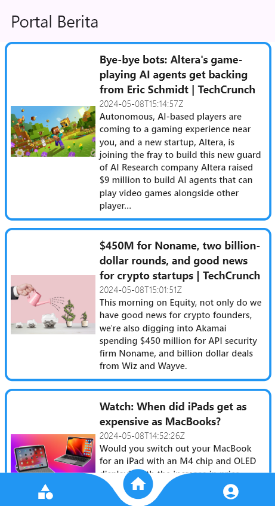
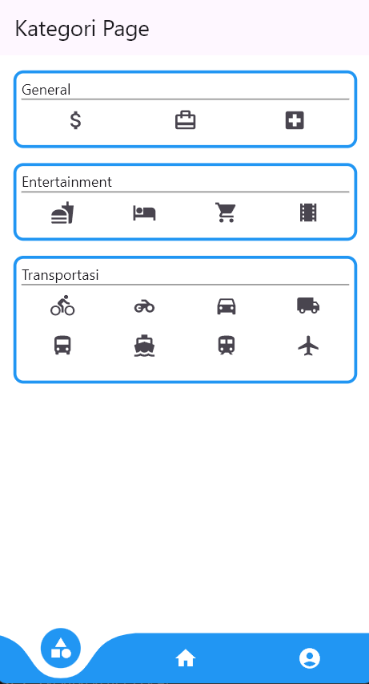
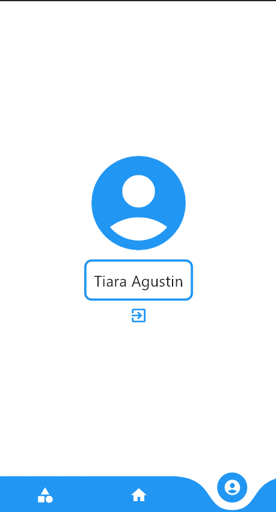
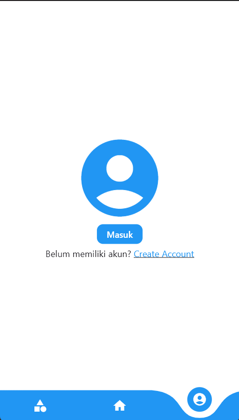

# News-Portal-with-Flutter

Aplikasi News Portal merupakan aplikasi berita mobile yang memungkinkan 
pengguna untuk melihat berita dari berbagai kategori, membaca detail berita, dan 
melakukan manajemen akun pengguna. 


## 📋 Daftar Isi
- [Fitur](#fitur)
- [Tangkapan Layar](#tangkapan-layar)
- [Struktur Proyek](#struktur-proyek)
- [Teknologi yang Digunakan](#teknologi-yang-digunakan)
- [Instalasi](#instalasi)
- [Penggunaan](#penggunaan)
- [Integrasi API](#integrasi-api)
- [Manajemen State](#manajemen-state)
- [Kontribusi](#kontribusi)
- [Lisensi](#lisensi)

## 📸 Tangkapan Layar
(Masukkan screenshot aplikasi Anda di sini)

## 🏗️ Struktur Proyek
```
lib/
├── main.dart        # Entry point dan pengaturan navigasi
├── home.dart        # Halaman utama daftar berita
├── kategori.dart    # Halaman kategori
├── profil.dart      # Halaman profil pengguna
├── detail.dart      # Halaman detail berita
├── formlogin.dart   # Form login
└── formregist.dart  # Form registrasi
```

## 🛠️ Teknologi yang Digunakan
- **Flutter**: Framework UI untuk pengembangan lintas platform
- **Dart**: Bahasa pemrograman
- **News API**: Untuk mengambil data berita real-time
- **Packages**:
  - `curved_navigation_bar`: Untuk navigasi bawah yang stylish
  - `http`: Untuk request API
  - `shared_preferences`: Untuk penyimpanan lokal data pengguna
  - `fluttertoast`: Untuk menampilkan pesan toast

## 📥 Instalasi

1. Clone repositori
```bash
git clone https://github.com/tiaraagustinn/News-Portal-with-Flutter.git
```

2. Masuk ke direktori proyek
```bash
cd News-Portal-with-Flutter
```

3. Install dependensi
```bash
flutter pub get
```

4. Jalankan aplikasi
```bash
flutter run
```

## 🚀 Penggunaan

### Halaman Home
Layar utama menampilkan daftar artikel berita terbaru. Setiap kartu artikel menunjukkan:
- Gambar
- Judul
- Tanggal publikasi
- Deskripsi singkat


### Halaman Detail
- Gambar
- Judul
- Tanggal publikasi
- Isi berita


### Halaman Kategori
Jelajahi berita berdasarkan kategori dengan tata letak grid yang intuitif:
- Berita umum
- Hiburan
- Transportasi


### Halaman Profil
Kelola profil pengguna Anda:
- Username Profil
- Tombol logout


### Halaman Registrasi
- Login ke akun Anda
- Daftar akun baru


## 🔌 Integrasi API
Aplikasi ini terintegrasi dengan News API untuk mengambil artikel terbaru:

```dart
Future<List> getData() async {
  final response = await http.get(Uri.parse(linkAPI));
  if (response.statusCode == 200) {
    var data = json.decode(response.body);
    return data['articles'];
  } else {
    throw Exception('Gagal memuat data');
  }
}
```

## 🔄 Manajemen State
- Menggunakan `StatefulWidget` Flutter untuk mengelola state UI
- Mengimplementasikan `SharedPreferences` untuk penyimpanan login yang persisten
- Pengambilan data yang efisien dengan `FutureBuilder`

---

## Author
Tiara Agustin (2208107010004)